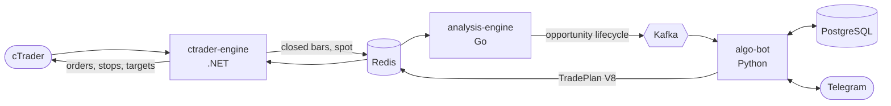

<div align="center">

# ApexVoid Trading Bot

**A self-hosted, multi-symbol trading stack for cTrader.**
Closed bars in, one best-ranked TradePlan out, with every decision owned by exactly one service.

[](https://github.com/st-mich43l/apexvoid-trading-bot/actions/workflows/autotrade-integrity.yml)
[](https://github.com/st-mich43l/apexvoid-trading-bot/actions/workflows/deploy.yml)
[](LICENSE)


</div>

---

## At a glance

| | |
|---|---|
| **Instruments** | XAU (gold), EURUSD, GBPUSD, GBPJPY, USDJPY |
| **Strategies** | 21 independent technical strategies, each a Go package |
| **Analysis** | Go engine over closed M1/M5/M15/H1 bars: structure, liquidity, zones, sessions, regime |
| **Execution contract** | TradePlan V8: absolute entry, stop and targets, declared once, executed without recomputation |
| **Broker** | cTrader Open API, through a single broker-facing service |
| **Control** | Telegram: signals, owner commands, journal, manual `/algo` |

## How it works



```text
cTrader feed → Redis closed bars → Go Analysis Engine → Kafka opportunities
  → Python Algo Bot → TradePlan V8 (Redis) → cTrader Engine → broker
```

Each service owns one kind of decision and is not allowed to make another's:

| Service | Owns | Never owns |
|---|---|---|
| **`analysis-engine`** (Go) | market structure, liquidity, zones, every strategy, opportunity identity and lifecycle, thesis grouping | account risk, exposure policy, Telegram, broker access |
| **`algo-bot`** (Python) | admission, same-thesis arbitration, entry-corridor reservation, exposure and risk policy, TradePlan construction, Telegram, journal, manual `/algo` | market structure, zones, detectors, scanning |
| **`ctrader-engine`** (.NET) | the cTrader feed, broker execution, stops and targets, cancel and expiry, the final exposure fence | any technical judgement |

Python does not scan markets or rebuild zones: a missing technical fact is an engine
or contract defect, never a reason to recompute it elsewhere.

## The decision cycle

Every closed bar is one decision cycle per symbol:

1. **Load** the live opportunities Go has published for the symbol.
2. **Admit** the executable ones: fresh, not expired, enabled for this instrument, above the confluence floor, quote and spread inside the entry contract.
3. **Arbitrate** same-thesis intents best-first. Strategies stay independent, so several can fire on one idea; one wins per thesis, ranked on execution eligibility, strategy quality, confluence, structural quality, freshness and a deterministic id. No strategy is favoured.
4. **Reserve** the winner's entry corridor in a single Redis script, so two workers cannot both win it. The reservation holds for 45 minutes and fails closed.
5. **Publish** at most one TradePlan per symbol per cycle.
6. **Fence**: the executor re-checks opposite-direction exposure against tracked plans and real broker positions before its first order.

Details, reason codes and the Redis keys involved are in [docs/execution.md](docs/execution.md).

## Safety properties

- **No duplicate execution.** Idempotent Kafka consumption, a per-thesis claim, a per-cycle owner, a plan-id publication tombstone and an executor claim make redelivery, retries, restarts and Redis reconnects harmless.
- **Exposure is per instrument, enforced twice.** FX never allows an opposite position on the same symbol. XAU allows one only at least 150 pips from every existing opposite group. Algo Bot checks at admission; the executor checks again at the broker.
- **Fail closed.** A missing exposure policy, an unreservable corridor or an uncertain ownership state blocks the plan rather than guessing.
- **Expiry never closes a position.** An expired or invalidated plan cancels its resting orders, keeps filled exposure under normal stop and target management, and retires when flat.
- **Session is context, not a gate.** No London or New York window blocks a plan on any instrument.

## Instruments

| Instrument | Entry | Stop envelope | Targets | Opposite exposure |
|---|---|---|---|---|
| **XAU** | scale-in: 80% at the proximal edge, 20% deeper; optional risk leg | 50-60 pips | 1R / 2R / 3R / 4R, closing 40/20/20/20, BE after 1R | allowed at 150 pips or more |
| **EURUSD** | single entry | 12-20 pips | 1R / 2R, closing 50/50, BE after 1R | never |
| **GBPUSD** | single entry | 15-25 pips | 1R / 2R, closing 50/50, BE after 1R | never |
| **GBPJPY** | single entry | 22-35 pips | 1R / 2R, closing 50/50, BE after 1R | never |
| **USDJPY** | single entry | 18-28 pips | 1R / 2R, closing 50/50, BE after 1R | never |

## Strategies

Twenty-one independent strategies. Each has its own ID, version, thresholds,
confirmation, quality, entry zone, invalidation, targets and lifecycle; none imports,
calls, waits for or is suppressed by another, and there is no strategy family. They
read one shared market-intelligence layer (structure, liquidity, zones, indicators);
one opportunity lifecycle and one execution authority sit downstream. Certification
and containment are separate per-strategy facts: `LEGACY_PARITY_PROVEN` (reproduces
the frozen Python publisher on committed real captures), `GO_NATIVE_VALIDATED` (no
predecessor, pinned by its own contract tests), and whether an instrument trades or
only observes it.

| Strategy ID | Technical thesis | Timeframes | Configuration | Parity / validation | Execution |
|---|---|---|---|---|---|
| `key_level` | Reaction at a clustered key level, with its role and structure | M5 | `strategies.key_level` (v3) | `LEGACY_PARITY_PROVEN` (profitable-week scalp lane, a1c77584) | live |
| `confluence_zone` | Two or more distinct canonical zone techniques overlapping on one side, then a reaction; its own opportunity beside theirs | M5 | `strategies.confluence_zone` (v2) | `LEGACY_PARITY_PROVEN` | live |
| `supply` | Reaction at a canonical supply zone | M5; M15 zones analysis-only | `strategies.supply` (v2) | `LEGACY_PARITY_PROVEN` (M5 zones; M15 has no oracle) | live |
| `demand` | Reaction at a canonical demand zone | M5; M15 zones analysis-only | `strategies.demand` (v2) | `LEGACY_PARITY_PROVEN` (M5 zones; M15 has no oracle) | live |
| `order_block` | Reaction at a canonical order-block zone | M5 | `strategies.order_block` (v2) | `LEGACY_PARITY_PROVEN` | live |
| `fvg` | Reaction at a canonical fair value gap | M5 | `strategies.fvg` (v2) | `LEGACY_PARITY_PROVEN` | live |
| `ifvg` | Reaction at an inverted fair value gap | M5 | `strategies.ifvg` (v2) | `LEGACY_PARITY_PROVEN` | XAU observe-only; live on FX |
| `crt` | Closed H1 range, M5 sweep and reclaim | M5 (H1 range) | `strategies.crt` (v2) | `LEGACY_PARITY_PROVEN` | live |
| `flip_zone` | Zone born of an accepted role flip, then a reaction | M5 | `strategies.flip_zone` (v3) | `LEGACY_PARITY_PROVEN` | live |
| `session_level` | Session, previous-day and previous-week highs and lows, then a reaction | M5 | `strategies.session_level` (v3) | `LEGACY_PARITY_PROVEN` | XAU observe-only; live on FX |
| `trendline` | Causal trendline with health and live interaction, then a reaction | M5 | `strategies.trendline` (v3) | `LEGACY_PARITY_PROVEN` (few decisions: the gate is narrow) | live |
| `range_edge` | M5 range context, edge rejection | M5 | `strategies.range_edge` (v2) | `LEGACY_PARITY_PROVEN` | live |
| `box_breakout` | Accepted break of the regime box, accepting-bar or retest entry | M5 | `strategies.box_breakout` (v3) | `LEGACY_PARITY_PROVEN` | live |
| `break_retest` | Broken trendline or key level, same-side retest and hold | M5 | `strategies.break_retest` (v2) | `LEGACY_PARITY_PROVEN` | live |
| `momentum_ride` | Displacement sequence against opposing liquidity | M5 | `strategies.momentum_ride` (v2) | `LEGACY_PARITY_PROVEN` | live |
| `snap_back` | Extension from a key level or zone, graded liquidity grab | M5 | `strategies.snap_back` (v2) | `LEGACY_PARITY_PROVEN` | live |
| `fade_scalp` | Equal-level sweep and reclaim, premium/discount, chop edge | M5 | `strategies.fade_scalp` (v2) | `LEGACY_PARITY_PROVEN` | live |
| `liquidity_sweep` | Lone-extreme pool sweep and reclaim, graded grab | M5 | `strategies.liquidity_sweep` (v3) | `GO_NATIVE_VALIDATED` (no Python predecessor) | XAU observe-only; live on FX |
| `range_sweep` | M5 range, M1 edge excursion and reclaim (XAU only) | M1 (M5 range) | `strategies.range_sweep` (v3) | `LEGACY_PARITY_PROVEN` | live (XAU) |
| `impulse_pullback` | M5 impulse, corrective pullback, structural reference, M1 confirmation (XAU only) | M1 (M5 impulse) | `strategies.impulse_pullback` (v3) | `LEGACY_PARITY_PROVEN` on synthetic data only | observe-only on every instrument |
| `scalp_breakout_retest` | M5 compression, M1 acceptance and retest (XAU only) | M1 (M5 compression) | `strategies.scalp_breakout_retest` (v3) | `LEGACY_PARITY_PROVEN` | live (XAU) |

Configuration keys live in [`config/analysis.yml`](config/analysis.yml). An instrument
can observe a strategy without trading it (`observe_only_strategies` in
[`config/instruments.yml`](config/instruments.yml)); each containment is recorded with
its live evidence in [docs/strategies/README.md](docs/strategies/README.md), which also
holds the full certification matrix, proof, replay coverage and a specification per
strategy.

## Repository layout

```text
analysis-engine/     Go: indicators, structure, zones, strategies, lifecycle, Kafka, replay
algo-bot/            Python: admission, arbitration, exposure, TradePlan, Telegram, journal
ctrader-engine/      .NET: cTrader feed, Redis bar sink, broker execution
config/              the one non-secret configuration authority (YAML)
contracts/           cross-service schemas and parity fixtures
deployment-template/ production Compose / Ansible templates
docs/                architecture, execution, configuration, operations, strategies
```

## Quick start

```bash
cp .env.example .env              # secrets and bootstrap only
docker compose config -q          # validate the stack
docker compose up -d
```

Behaviour lives in `config/*.yml`; `.env` holds only credentials, ids and bootstrap
switches. See [docs/configuration.md](docs/configuration.md) and
[docs/operations.md](docs/operations.md) for deployment, checks, backups and incident
response.

## Development

```bash
# Go analysis engine
cd analysis-engine && go build ./... && go vet ./... && go test ./...

# Python algo bot (needs Redis and Postgres, see the CI workflow)
cd algo-bot && PYTHONPATH=. pytest -q $(grep -E '^tests/' tests/ci_autotrade_paths.txt)

# .NET execution engine
cd ctrader-engine && dotnet test tests

# Validate the configuration tree
PYTHONPATH=algo-bot python config/scripts/resolve_reference.py --all
```

The analysis engine has a deterministic replay command (`cmd/replay`) and committed
real-capture fixtures and parity goldens under `analysis-engine/testdata/`. Capture fresh
bars read-only from a running stack with `python -m tools.capture_bars` inside the bot
container.

## Documentation

| | |
|---|---|
| [Architecture](docs/architecture.md) | ownership, data planes, dependency rules |
| [Execution](docs/execution.md) | the decision cycle, arbitration, exposure, expiry, TradePlan |
| [Configuration](docs/configuration.md) | files, secrets, reachability, containment |
| [Operations](docs/operations.md) | deployment, routine checks, backups, incidents |
| [Strategies](docs/strategies/README.md) | certification matrix and per-strategy specifications |
| Reference | [Redis contract](docs/redis-contract.md), [Kafka transport](docs/transport/kafka.md), [bot commands](docs/bot-commands.md), [security](docs/security.md), [decisions](docs/adr/) |

## License

[MIT](LICENSE)
