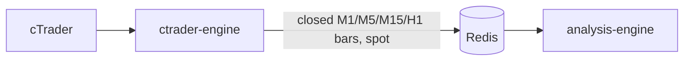
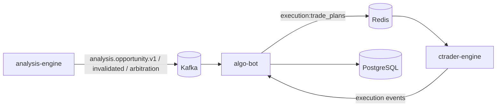

# ApexVoid architecture

ApexVoid is a self-hosted multi-symbol trading stack for cTrader. One service
owns each decision, and the boundaries below are binding: a change that gives a
service a decision listed under "must not own" is a boundary violation.

```text
cTrader feed → Redis closed bars → Go Analysis Engine → Kafka opportunities
  → Python Algo Bot → TradePlan V8 (Redis) → cTrader Engine → broker
```

| Component | Owns | Must not own |
|---|---|---|
| `ctrader-engine` (.NET) | cTrader auth and market feed, closed bars to Redis, broker account state, order and position lifecycle, SL/TP/BE, reconciliation, the final exposure fence | any technical judgement (zone validity, bias, liquidity quality, strategy confidence) |
| `analysis-engine` (Go) | indicators, structure, liquidity, zones, sessions, regime, every strategy, opportunity identity and lifecycle, thesis grouping, Kafka publication | account risk, exposure policy, Telegram, broker access |
| `algo-bot` (Python) | opportunity consumption, admission, same-thesis arbitration, entry-corridor reservation, exposure and risk policy, TradePlan construction, Telegram, journal, manual `/algo` | market structure, zones, detectors, scanning |
| Redis | closed bars, spot, TradePlan stream, plan state, cancel intents, locks and reservations | durable history |
| Kafka | the durable `analysis.opportunity.*` lifecycle | execution traffic |
| PostgreSQL | opportunity ledger, plans, fills, results, journal, statistics | live trading state |

Python does not scan markets, rebuild zones or run detectors. Missing technical
facts are an Analysis Engine or contract defect, never a reason to recompute in
Python. There is one configuration authority: `config/*.yml`
([configuration](configuration.md)).

## Market-data plane



The engine bootstraps from the Redis bar history (`bars:{SYMBOL}:{TF}`) and then
processes closed-bar notifications. Kafka is not used for any internal
calculation.

## Opportunity and execution plane



Every closed bar is one decision cycle per symbol. Algo Bot loads the live Go
opportunities, admits the executable ones, arbitrates them, publishes at most
one TradePlan, and the executor re-checks exposure before the first broker
order. [Execution](execution.md) describes each stage and its guarantees.

## Analysis Engine

```text
Redis bars → marketdata/history
  → indicator + structure + liquidity + zones + context
  → strategy registry (21 independent strategies)
  → opportunity book + thesis grouping
  → Kafka lifecycle publisher
```

- `market`, `marketdata`, `indicator`: canonical bar and measurement types.
- `structure`, `liquidity`, `techniquezone`, `zone`, `trendline`, `context`:
  causal technical state.
- `strategy`, `strategyutil`, `confluence`, `regime`, `session`, `fib`, `mad`:
  strategy inputs and the independent implementations. Strategies never import
  one another, Redis, Kafka, Postgres, Telegram, cTrader or Algo Bot; the
  architecture test enforces package ranks.
- `legacyread`: the detector-contract read. Strategies that reproduce a frozen
  detector decision gate on it (bounded M5/M15/H1 windows, the detector swing
  algorithm, scored zones, pools and grabs, sessions, trendlines, scalp
  barriers and range, regime, momentum, higher-timeframe bias). It is derived
  only from the same closed candles, not a second bar source or structure
  authority, and uses the Wilder ATR the detectors used.
- `opportunity`, `arbitration`, `state`, `engine`: lifecycle and evaluation.
  Arbitration groups opportunities that share a structure into one thesis
  (`go_thesis_id`) and publishes winner/suppressed/conflict decisions as
  provenance telemetry; it never decides what trades.
- `transport/redis`, `transport/kafka`: market input and event output.

Session is analysis context and a confluence/quality input, never a clock gate:
no London/NY window blocks a plan on any instrument. The MAD Asia-phase
classifier (accumulation, manipulation, expansion) is likewise soft context
stamped onto opportunities.

Every strategy owns its own candidates: disabling one never changes another's, and a
confluence overlap never removes a technique's setup (Confluence Zone publishes its own
opportunity beside theirs). There is no strategy family anywhere in the stack. On the
Algo Bot side each strategy's execution profile is its own row in
`app/autotrade/strategy_catalog.py`; the `strategy_family` string on TradePlan V8 and
persisted events is a record label that no decision reads. See the
[independence audit](strategies/independence-audit.md).

Every strategy is evaluated on every symbol it is configured for; the
instrument decides execution (observe-only lists in `config/instruments.yml`),
not the strategy code. [Strategies](strategies/README.md) holds the
certification matrix.

## Algo Bot

`app/analysis_client` decodes and persists the Kafka lifecycle. `app/autotrade`
holds admission, arbitration, exposure, TradePlan construction and event
handling. `app/bot` and `app/signals` are Telegram, the journal and the manual
workflow. `app/scalping` keeps outcome accounting only.

Manual `/algo` plans carry the plan-kind label `strategy_family=manual` (a record label, not a strategy family), are labelled `algo_manual`
and are exempt from the autonomous exposure rules: an owner instruction is a
direct decision, not analysis output.

## cTrader Engine

The executor claims a plan, sizes it against live equity and submits the
declared legs without recomputing entry, stop or targets. It honours cancel
intents, retires expired plans (cancelling resting legs, keeping filled
exposure), and runs `OppositeExposureFence` before the first broker mutation of
a plan. cTrader is the only broker-facing service.

## Dependency rule

```text
market / telemetry
  → indicator / marketdata / config
  → structure / techniquezone / zone / liquidity
  → context / confluence / opportunity
  → strategy / legacyread / strategyutil / state / arbitration
  → concrete strategies / transport
  → engine
```

`analysis-engine/test/architecture` enforces the allowed package ranks.
