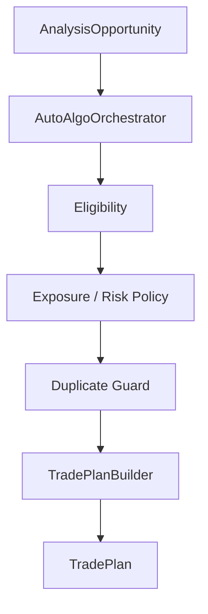

# Algo Bot (Python)

"What should ApexVoid do about it?" — trading orchestration and control
plane. Consumes analysis; never computes it. See
[`service-boundaries.md`](service-boundaries.md) for the owns/must-not-own
list and the current violations (`app/analysis/*`, `app/scalping/*`) this
document does not repeat.

## Target tree (§38–49)

```text
algo-bot/
├── app/
│   ├── config/            → app/configuration/ (exists, already correct — Configuration V3)
│   ├── transport/          → new: analysis-engine event consumption (Kafka/Redis client wiring)
│   ├── analysis_client/     → new: consume+validate+deserialize analysis-engine's opportunity events
│   ├── auto_algo/           → app/autotrade/* reorganized: eligibility, policy, duplicate_guard, exposure, risk_budget, lifecycle, trade_plan_builder, state
│   ├── manual_algo/         → app/signals/{fx_manual_algo,manual_algo_chart,manual_execution,manual_intent,parsing}.py reorganized
│   ├── risk/                → app/autotrade/{active_exposure,arbitration}.py + new account_state/limits/policy
│   ├── execution/            → app/autotrade/{trade_plan,trade_plan_stream,route_outcome,event_integrity}.py reorganized
│   ├── telegram/             → app/bot/* reorganized (commands/handlers/formatters/notifications/middleware)
│   ├── journal/               → app/autotrade/setups_report.py + app/signals/reports.py reorganized
│   ├── trade_records/          → app/persistence/store.py's trade-record surface split out
│   ├── persistence/            → app/persistence/* (exists, keep)
│   ├── runtime/                 → app/runtime/* (exists, keep)
│   └── telemetry/                → app/autotrade/funnel_diagnostics.py + reaction_funnel.py reorganized
│
└── tests/                        → tests/ (exists, keep; ~840+ tests, CI allowlist in tests/ci_autotrade_paths.txt)
```

**This task does not create these directories.** Per the source task's own
restraint principle (§58, applied here even though it's written under the
Go section): `algo-bot` is the live production control plane this
session traded real (demo) money through, multiple times, today. Moving
~9.7MB of Python across new package boundaries with no `analysis-engine`
yet to consume is pure churn with no dependency boundary to prove — there
is nothing on the other side of `analysis_client/` to import from yet. The
target tree above is the freeze; the migration map
([`migration-map.md`](migration-map.md)) records the action and timing.
Actual file moves happen once `analysis-engine` publishes a real
`analysis.opportunity.v1` event this package can consume — otherwise
`analysis_client/` would be an empty package importing nothing, which is
exactly the "empty architecture theater" the source task warns against.

## `analysis_client` (§39)

```text
analysis_client/
├── consumer.py      — consume analysis events (Kafka once §33 cutover; Redis today)
├── models.py         — typed Python DTOs mirroring contracts/analysis/opportunity-v1.schema.json
├── repository.py      — typed accessors over the latest opportunity set per symbol
└── cache.py            — short-lived local cache, not a second source of truth
```

No technical recalculation. If a consumer needs a value `analysis_client`
doesn't expose, the fix is a new field on the `analysis.opportunity.v1`
contract, never a local Python recomputation.

## Auto Algo flow (§41, frozen)



Today's real equivalent (verified this session, live): ZoneWatch discovery
→ location/activation gates → `_evaluate_record`/`_sync_strategy_match_cutover`
→ `_publish_trade_plan_v8`. This is the same shape with different names;
the target rename is cosmetic reorganization, not a logic rewrite, once it
happens.

## Manual Algo (§42)

May request current analysis context from `analysis_client`. Must not
depend on `auto_algo`'s strategy-detection internals — it already doesn't
(confirmed: `app/signals/manual_execution.py` and friends build
`StrategyMatch`/TradePlan directly from owner-supplied zone/SL/TP, no
detector call). Manual and auto may share risk primitives (position
sizing, stop-envelope math) — this is already true today
(`app/autotrade/protective_stop.py`, `execution_policy.py` serve both
paths) and stays true under the target tree.

## TradePlan ownership (§45, frozen)

```text
analysis-engine → AnalysisOpportunity
algo-bot        → TradePlan
ctrader-engine  → Order / Position
```

`analysis-engine` must never publish broker-ready position sizing directly
— confirmed nothing in the existing Go code does or could (no risk/account
concept exists in `internal/`). `algo-bot` is the only service that turns
"a technically valid setup" into "a sized, risk-checked order."

## Execution boundary (§44)

```text
execution/
├── publisher.py       — publishes TradePlan
├── consumer.py          — consumes execution events
├── models.py             — typed DTOs mirroring contracts/execution/*.schema.json
├── reconciliation.py       — reconciles algo-bot's view against ctrader-engine's execution events
└── idempotency.py           — dedup / replay-safety for both directions
```

No direct broker SDK integration — confirmed: nothing in
`app/autotrade/*` imports a cTrader client library; all broker interaction
is via Redis-published TradePlan / consumed execution events, matching
this boundary already.

## Persistence (§49)

PostgreSQL is `algo-bot`'s, primarily: opportunity references, TradePlans,
orders, fills, results, journal, risk decisions, operator actions,
statistics. `analysis-engine`'s hot path must never require Postgres —
confirmed true today (nothing in `internal/` touches a database).
`ctrader-engine` never touches Postgres — confirmed by the existing
architecture doc and unchanged by this task.
