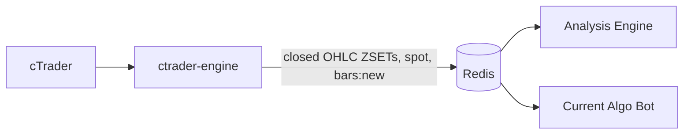
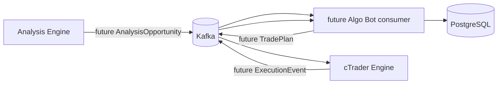

# Event flow

## Market-data plane — live



Redis is the authority for operational market data:

- `bars:{SYMBOL}:{TIMEFRAME}` is the closed-bar history.
- `price:{SYMBOL}:spot` is transient bid/ask.
- `bars:new` is only a low-latency wake-up signal.
- Analysis Engine subscribes before bootstrap, reads the authoritative ZSETs,
  and reconciles periodically, so missed pub/sub messages cannot create a
  candle gap.

cTrader does not publish market bars or ticks to Kafka. Analysis Engine does
not consume market bars or ticks from Kafka.

## Trading-event and command plane — staged



The explicitly provisioned Kafka topics are:

```text
analysis.opportunity.v1
analysis.opportunity.invalidated.v1
execution.trade-plan.v1
execution.trade-event.v1
```

The Analysis Engine Kafka producer is ready, but no technical strategy produces
real opportunities yet. Algo Bot's opportunity consumer, TradePlan publisher,
and cTrader execution consumer/event producer are not implemented. Redis
streams continue serving the existing execution path until those services are
migrated deliberately.

PostgreSQL remains the permanent business history for plans, fills, journal,
statistics, and audit records. It is not the market-bar bootstrap store.

## Non-negotiable boundary

Kafka topics are not created for internal calculations such as ATR, swings,
BOS, liquidity, FVGs, or zones. Those remain inside the symbol state of the
service that computes them. See [ADR-010](../adr/010-redis-market-data-kafka-events.md)
for the ownership decision.
