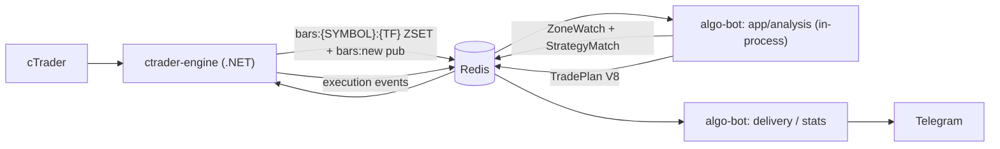
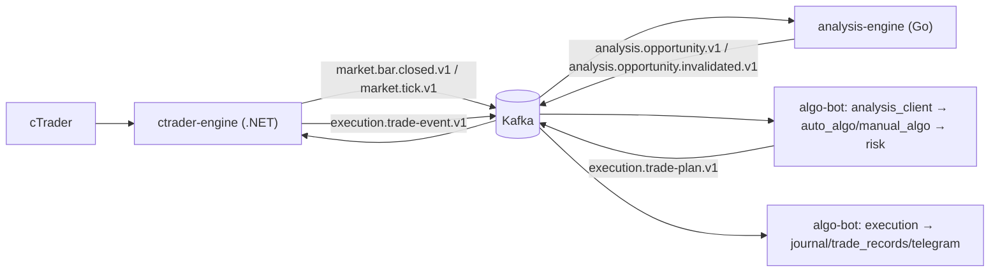

# Event Flow

## Current (verified live, this session)



Redis is the only cross-service boundary today (`ctrader-engine` "never
touches Postgres; Redis is the only cross-service boundary,"
`docs/redis-contract.md`). `algo-bot`'s `app/analysis` computes structure
in-process — there is no analysis-engine in this loop yet.

## Target



The only structural difference from today: `algo-bot`'s in-process
computation is replaced by consuming `analysis.opportunity.v1` from
`analysis-engine`, and the transport moves from Redis to Kafka. Everything
downstream of "algo-bot has an opportunity" is unchanged in shape.

## Kafka topics (§33, frozen)

```text
market.bar.closed.v1
market.tick.v1

analysis.opportunity.v1
analysis.opportunity.invalidated.v1

execution.trade-plan.v1
execution.trade-event.v1
```

**Forbidden**: a topic per internal calculation (`analysis.atr`,
`analysis.swing`, `analysis.fvg`, `analysis.bos`, ...). Those stay internal
to `analysis-engine`'s own `SymbolState` — nothing outside the service ever
needs a partial computation, only the resulting `AnalysisOpportunity`.

No Kafka broker, topic, or client library exists in this repo as of this
task. The topic names above are frozen as the target contract surface;
schemas for the four event classes live under `contracts/` (see
[`../adr/007-shared-cross-service-contracts.md`](../adr/007-shared-cross-service-contracts.md)).

## Redis role, before and after Kafka cutover (§34)

Today: Redis is the durable cross-service bus (bars, ZoneWatch, TradePlan,
telemetry, execution events) — see `docs/redis-contract.md` for the full
key inventory. This does not change until Kafka cutover happens.

Target, once Kafka is live: Redis narrows to transient/cache/state support
only — latest quote, latest analysis snapshot, health, dedup, short-lived
caches, bootstrap candle cache. Redis stops being the primary durable
cross-service event bus. No date is set for this cutover; it is not part
of this architecture-definition task's scope.
