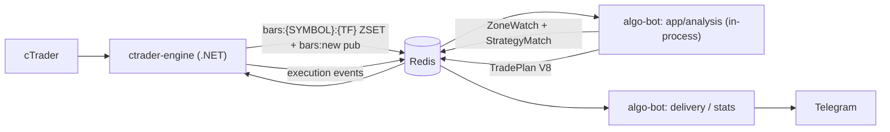
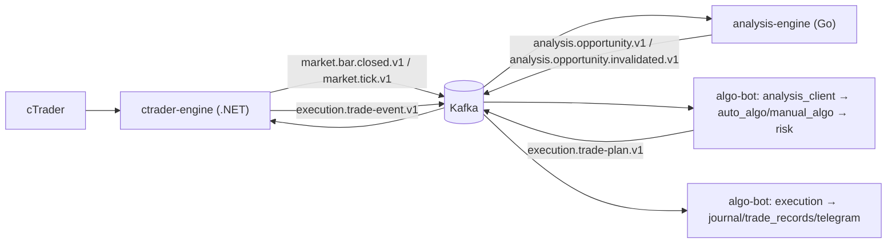

# Event Flow

## Current (verified live, this session)



Kafka is now the cross-service market-event boundary: cTrader publishes
`market.bar.closed.v1` after broker acknowledgement, then updates Redis's
bar cache. `analysis-engine` consumes the event and dispatches it through its
existing engine path. Redis remains the compatibility/cache surface for the
legacy bot loop; algo-bot's `app/analysis` is not cut over to opportunity
consumption in this task.

## Target



The only structural difference from today: `algo-bot`'s in-process
computation is replaced by consuming `analysis.opportunity.v1` from
`analysis-engine`, and the transport moves from Redis to Kafka. Everything
downstream of "algo-bot has an opportunity" is unchanged in shape.

## Kafka topics (§33, frozen)

```text
market.bar.closed.v1
market.tick.v1

analysis.opportunity.v1
analysis.opportunity.invalidated.v1

execution.trade-plan.v1
execution.trade-event.v1
```

**Forbidden**: a topic per internal calculation (`analysis.atr`,
`analysis.swing`, `analysis.fvg`, `analysis.bos`, ...). Those stay internal
to `analysis-engine`'s own `SymbolState` — nothing outside the service ever
needs a partial computation, only the resulting `AnalysisOpportunity`.

The Go side of the first four topics is real — `analysis-engine/internal/transport/kafka` is a working
producer/consumer/codec, proven against a real broker
([ADR-008](../adr/008-go-kafka-client.md), [ADR-009](../adr/009-kafka-delivery-semantics.md),
[`../transport/kafka.md`](../transport/kafka.md)). The cTrader market-bar
producer and analysis-engine consumer are live in the Compose topology.
`algo-bot` does not yet consume `analysis.opportunity.v1`, and no strategy is
currently publishing a real opportunity. `execution.trade-plan.v1` /
`execution.trade-event.v1` remain entirely unimplemented, explicitly out
of that task's scope. Schemas for all six event classes (plus the shared
`contracts/common/event-envelope-v1.schema.json` wrapper) live under
`contracts/` (see
[`../adr/007-shared-cross-service-contracts.md`](../adr/007-shared-cross-service-contracts.md)).

## Redis role, before and after Kafka cutover (§34)

Today: Kafka is the durable market-event bus, while Redis still carries the
legacy bot bus (ZoneWatch, TradePlan, telemetry, execution events) and bar
cache — see `docs/redis-contract.md` for the full key inventory.

Target, once Kafka is live: Redis narrows to transient/cache/state support
only — latest quote, latest analysis snapshot, health, dedup, short-lived
caches, bootstrap candle cache. Redis stops being the primary durable
cross-service event bus. No date is set for this cutover; it is not part
of this architecture-definition task's scope.
