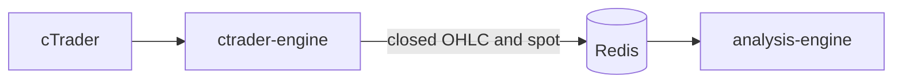
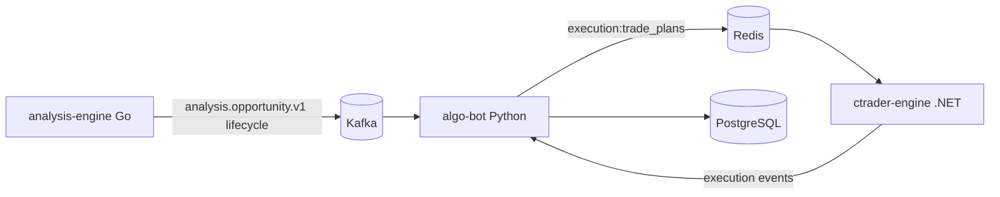

# Event flow

## Market-data plane

```mermaid
flowchart LR
  CT[cTrader] --> CE[ctrader-engine]
  CE -->|closed OHLC and spot| R[(Redis)]
  R --> AE[analysis-engine]
```

Analysis Engine bootstraps from the authoritative Redis bar history and then
processes closed-bar notifications. Redis remains the market-data plane;
Kafka is not used for internal ATR, structure, liquidity, or zone calculations.

## Opportunity and execution plane

```mermaid
flowchart LR
  AE[analysis-engine Go] -->|analysis.opportunity.v1 lifecycle| K[(Kafka)]
  K --> AB[algo-bot Python]
  AB -->|execution:trade_plans| R[(Redis)]
  R --> CE[ctrader-engine .NET]
  CE -->|execution events| AB
  AB --> PG[(PostgreSQL)]
```

Analysis Engine owns technical opportunity identity, facts, strategy output,
and lifecycle. Algo Bot owns the non-technical decision to create a TradePlan,
including freshness, quotes, session/news checks, exposure, and risk. The
cTrader engine validates and executes the resulting plan.
