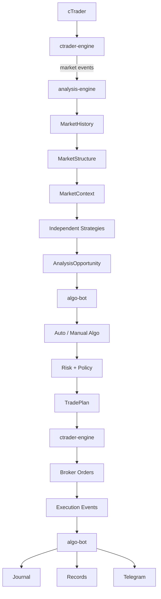

# ApexVoid V2 Service Architecture

Status: **FROZEN** (architecture-definition task, 2026-09-22). This document
and its siblings under `docs/architecture/` and `docs/adr/` are the binding
reference for the three-service split. They define target shape and
boundaries; they do not themselves change production behavior. See
`docs/architecture/migration-map.md` for what moves, and when.

This freeze does not repeat or contradict two existing, more detailed audits
that predate it and remain authoritative for their own scope:

- `docs/go-analysis-migration-audit.md` — the Python→Go computation graph,
  every duplicate/divergent calculation found, and the first migration
  slice. This document's Analysis Engine package boundaries (§ below) match
  that audit's package names deliberately.
- `docs/configuration-v3-migration-audit.md` — Configuration V3's
  cross-language parity proof and staged rollout (Stage C0–C6). This
  document's Configuration Ownership section defers to it entirely.

## The three services

```text
analysis-engine   →  Go     →  "What is happening in the market?"
algo-bot          →  Python →  "What should ApexVoid do about it?"
ctrader-engine    →  .NET   →  "How should the broker operation be executed safely?"
```

These responsibilities are frozen and must not blur. The single clearest
test for "which service owns this code": if the answer changes when the
broker, the account, or the operator changes, it is `algo-bot`'s or
`ctrader-engine`'s. If the answer is the same regardless of who is trading
or how much risk they're willing to take, it is `analysis-engine`'s.

Full per-service ownership tables (owns / must-not-own) are in
[`service-boundaries.md`](service-boundaries.md).

## Runtime flow



This is the target flow. The **current** production flow (verified live
this session) differs in one respect: `algo-bot` still computes technical
structure in-process (`app/analysis/*`) rather than consuming it from
`analysis-engine` — see [`event-flow.md`](event-flow.md) for the current vs.
target diagram side by side, and
[`migration-map.md`](migration-map.md) for the cutover path.

## Documents in this set

| Document | Answers |
|---|---|
| [`analysis-engine.md`](analysis-engine.md) | Go package tree, dependency graph, `SymbolState`/`MarketContext`/`Candidate` shapes, testing convention |
| [`algo-bot.md`](algo-bot.md) | Target Python package tree, `auto_algo`/`manual_algo` flow, what moves out |
| [`service-boundaries.md`](service-boundaries.md) | Full owns/must-not-own tables per service, current violations |
| [`event-flow.md`](event-flow.md) | Current vs. target flow, Kafka/Redis topic ownership |
| [`dependency-rules.md`](dependency-rules.md) | Allowed/forbidden import directions, the one correction to the source task's own ordering |
| [`migration-map.md`](migration-map.md) | Current path → target service/package → action → when, for every top-level module in scope |

ADRs for the frozen decisions behind this document are under
[`../adr/`](../adr/), indexed there.

## What this freeze does not do

Per the architecture task's own scope (its §57–58): this freeze does not
redesign swing mathematics, BOS/CHoCH algorithms, or any strategy logic; it
does not port every legacy strategy; it does not cut over production
analysis; it does not delete working legacy Python analysis. The next task
in sequence is the Analysis Engine V2 Market Structure Specification
(pivot/swing semantics, structure hierarchy, BOS/CHoCH, liquidity
relationship, protected levels, causal confirmation) — that specification
is out of scope here and must be approved before new strategy
implementations begin.
